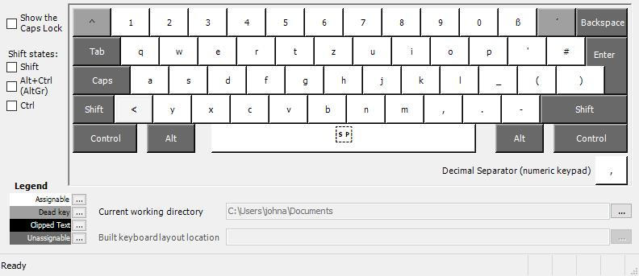
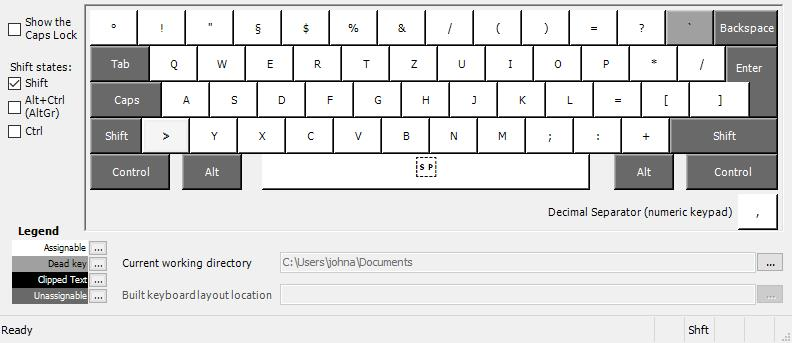
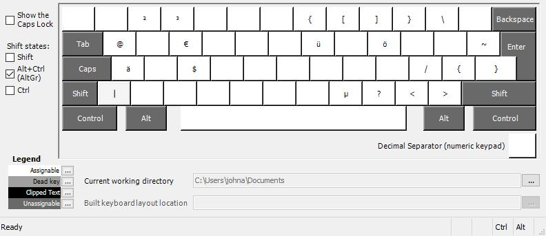
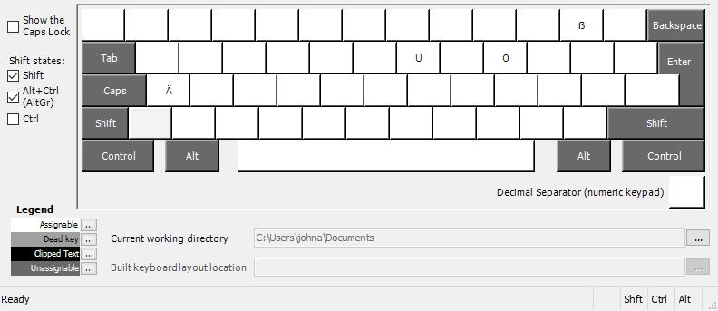

# Fancy_German


### Why I made this

The traditional German keyboard layout has three keys used exclusively for the "Umlaute" which are Ä, Ü and Ö. These are already quite rarely used when writing in German and effectively never in any other language, so obviously, allocating three entire keys in easy to reach places for them is quite a waste. Therefore, I came up with an easy and intuitive workaround to preserve the ability to use them without occupying valuable keyboard space: using this layout you can access them by holding alt-gr and typing their corresponding base form. To make them upper case additionally hold shift, like you would for any other character.

For example:

- alt-gr + a -> ä
- alt-gr + shift + u -> Ü
- alt-gr + o -> ö

I chose to occupy this newly created space for normally hard(er) to reach keys commonly used in programming and updated the surrounding space with semantically more appropriate symbols for a simple, intuitive and agile workflow.

### Images

Below are images showing what each key corresponds to while holding their respective modifier keys (shift, alt-gr).

#### No modifier:



#### Shift:



#### Alt-Gr:



#### Shift + Alt-Gr:



### How to install

#### Windows

Simply run `setup.exe` in the `fncygrm5` directory. After a restart, you should be able to switch to it using the normal windows-space or shift-alt combinations.
I would recommend setting `fancy_german` as your default keyboard layout, since switching is cumbersome, annoying and fairly pointless, since this is the objectively superior keyboard layout (surely).

The installer should automatically add the keyboard layout to your list once you restart. If it doesn't:

1. Open your search bar and type `language and keyboard`, click the similarly named setting.
2. Towards the bottom of the page should be your language, click on it, then options.
3. There, at the bottom again should be the `Add a keyboard` option. After installing the layout and at least rebooting once you should be able to find the `Fancy german v5` keyboard layout in the list.
4. (Optional) Finally, remove your old keyboard layout by clicking on it, then selecting the `Remove` option.

I have also included the fancy_german_v5.klc file for anyone who wants to modify this keyboard layout to suit their own needs. Just be warned that the official software required to create and modify custom keyboard layouts is very outdated, clunky and a bit buggy. It's appropriately called `Microsoft Keyboard Layout Creator (MSKLC)`.

#### Linux

1. Download the Linux release and unpack it.
1. Place `fancy_german_v5` file into the `/usr/share/X11/xkb/symbols` directory.
2. Open `evdev.xml` located in `/usr/share/X11/xkb/rules` using `sudo gedit evdev.xml`.
3. Search for `/layoutList`. Right above that insert the following code block so that the indentations match:

```
    <layout>
      <configItem>
        <name>fancy_german_v5</name>
        <shortDescription>fancy_german_v5</shortDescription>
        <description>fancy_german_v5</description>
        <languageList>
          <iso639Id>fancy_german_v5</iso639Id>
        </languageList>
      </configItem>
      <variantList>
      </variantList>
    </layout>
```

You can test if everything works by typing `setxkbmap -layout fancy_german_v5` into the console.

#### Enjoy!